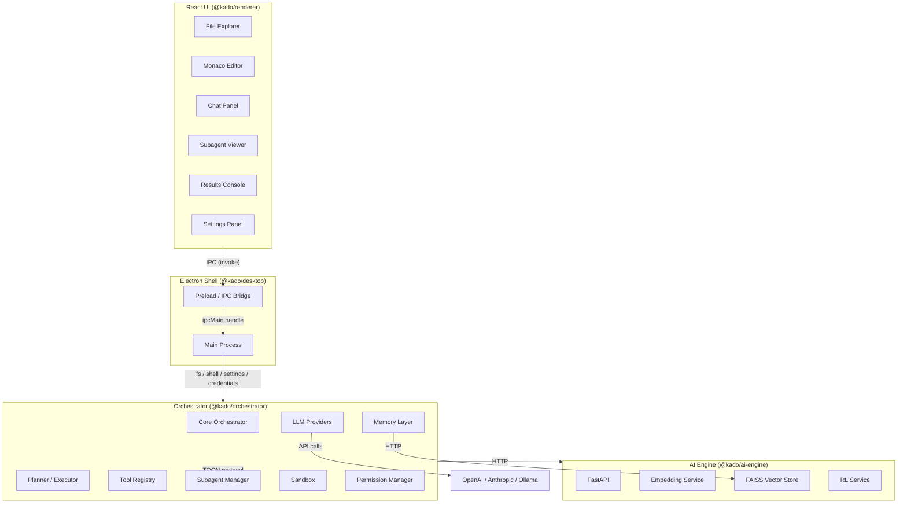

# Architecture

Kado v2 is a desktop application for autonomous code generation. It pairs a React-based UI with a Node.js orchestration layer and a Python FastAPI service for embeddings and reinforcement-learning feedback.

## Monorepo Structure

```
kado-v2/
├── packages/
│   ├── desktop/         # Electron main process & app shell
│   ├── renderer/        # React UI (Vite + TailwindCSS)
│   ├── orchestrator/    # Agentic orchestration, tools, LLM providers
│   ├── ai-engine/       # Python FastAPI — embeddings, vector store, RL
│   └── shared/          # Shared TypeScript types, TOON codec, constants
├── tools/               # Build & dev tooling
├── docs/                # Documentation
└── package.json         # Root workspace config (pnpm)
```

### Package Responsibilities

| Package | Language | Role |
|---------|----------|------|
| `@kado/desktop` | TypeScript | Electron main process — window management, IPC handlers, credential encryption |
| `@kado/renderer` | TypeScript / React | UI — file explorer, Monaco editor, chat panel, subagent viewer, results console, settings |
| `@kado/orchestrator` | TypeScript | Agent loop, planning, tool registry, LLM provider abstraction, subagent management, memory, sandbox |
| `@kado/ai-engine` | Python | FastAPI server — sentence-transformer embeddings, FAISS vector store, RL action logging |
| `@kado/shared` | TypeScript | Cross-package types (`ToolDefinition`, `TaskState`, `AgentMessage`), TOON codec, constants |

## High-Level Architecture



## Data Flow

1. **User interaction** — The renderer captures a message in the Chat panel and sends it over Electron IPC.
2. **IPC bridge** — The preload script exposes a `window.kado` API. Each call maps to an `ipcMain.handle` channel (e.g., `fs:readFile`, `shell:execute`).
3. **Orchestrator** — Receives the user request, runs it through the Planner to decompose into tasks, then executes those tasks via the tool registry and LLM providers.
4. **Subagents** — For parallelisable work the orchestrator spawns specialist subagents (code-review, refactor, test-writer, research, documentation) that communicate via the TOON binary protocol.
5. **AI Engine** — The orchestrator calls the FastAPI service over HTTP for semantic search (encode + query FAISS) and RL feedback logging.
6. **Results** — Tool outputs, diffs, and agent status updates stream back through IPC to the renderer for display in the console, editor, and chat panels.

## Component Details

### Electron Shell (`@kado/desktop`)

- **main.ts** — App lifecycle, window creation.
- **preload.ts** — `contextBridge.exposeInMainWorld("kado", ...)` — typed API surface.
- **ipc.ts** — All `ipcMain.handle` registrations: file system, shell, dialog, settings, and AES-256-GCM encrypted credential storage.
- **window.ts** — Window configuration and state persistence.

### React UI (`@kado/renderer`)

- **Layout** — Resizable three-panel layout: sidebar (file explorer), main area (editor + chat), bottom panel (console).
- **File Explorer** — Tree view with context menu, fuzzy search, and file icons.
- **Code Editor** — Monaco editor wrapper with multi-tab support and inline diff viewer.
- **Chat Panel** — Streaming message display, clarifying-question UI, markdown rendering.
- **Subagent Viewer** — Cards showing each spawned subagent's status and message flow.
- **Results Console** — Filtered terminal output for shell commands, test runs, and lint results.
- **Settings** — General, Model, Theme, and Shortcuts panels.
- **Onboarding** — First-run wizard: welcome, project selection, API key entry, tips.

### Agentic Orchestrator (`@kado/orchestrator`)

- **Core** — `Orchestrator` class, `StateMachine` for agent states, `EventBus` for decoupled events, `TaskQueue` for ordered execution.
- **Planning** — `Planner` decomposes high-level goals into executable steps; `Executor` runs them.
- **Tool Registry** — Pluggable registry of tools (file I/O, search, shell, testing, linting, web).
- **LLM Providers** — Abstraction over OpenAI, Anthropic, and Ollama with a `ModelSelector` for routing.
- **Subagent Manager** — Spawns and manages specialist subagents, each isolated with its own context.
- **Memory** — `ConversationStore`, `ContextPool`, `ContextWindow`, `KnowledgeBase`, and `VectorBridge` (HTTP to ai-engine).
- **Security** — `CredentialStore` (delegates to desktop IPC), `Encryption` utilities, `Sanitizer` for output.
- **Plugins** — `PluginManager` loads/unloads plugins in a sandboxed environment.
- **Permissions** — `PermissionManager`, `AuditLog`, and `Rollback` for safe file operations.
- **Sandbox** — `CommandFilter` (allow/deny-list), `NetworkGuard` for outbound request control.
- **Diff** — `DiffEngine` for computing and presenting file changes.

### AI Engine (`@kado/ai-engine`)

- **FastAPI app** — CORS-enabled, request-logging middleware, router-based route organisation.
- **Embedding Service** — `sentence-transformers` (default model: `all-MiniLM-L6-v2`).
- **Vector Store** — FAISS index with metadata mapping, persistence to disk.
- **RL Service** — Action logging, feedback collection, statistics, and optimisation endpoint.
- **TOON Protocol (Python)** — Matching encoder/decoder for the binary message format.

### Storage Layer

| Store | Location | Purpose |
|-------|----------|---------|
| Settings | `~/.kado/settings.json` | User preferences |
| Credentials | `~/.kado/credentials/*.enc` | AES-256-GCM encrypted API keys |
| FAISS index | `packages/ai-engine/data/faiss_index` | Vector embeddings |
| Conversation | In-memory (orchestrator) | Chat history per session |

## TOON Protocol

**T**ask **O**rchestration **O**ver **N**ode — a compact binary protocol for inter-agent communication.

- 18-byte header: version (1B), type (1B), payloadLength (4B LE), timestamp (8B LE), sequenceId (4B LE).
- JSON-encoded payload, optionally RLE-compressed for payloads > 1 KiB.
- Message types: `INSTRUCTION`, `TOOL_CALL`, `TOOL_RESULT`, `STATUS`, `ERROR`, `HEARTBEAT`, `CONTEXT_REQUEST`, `CONTEXT_RESPONSE`.

See [TOON Protocol Specification](api/toon-protocol.md) for the full binary format reference.
